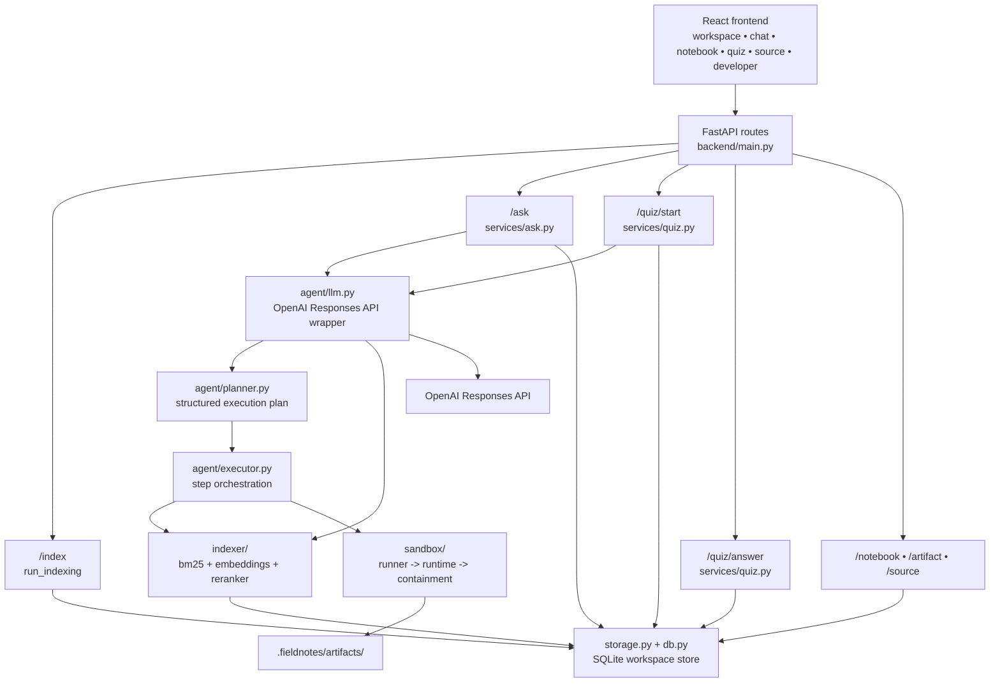

# Fieldnotes

[](https://github.com/Arya185/fieldnotes/actions/workflows/release.yml)

Student with folder full of course PDFs, slides, notes, and CSVs gets grounded answers and quizzes instead of pasting fragments into generic chatbot. Fieldnotes stays local-first, cites source passages for every claim, and keeps outputs traceable back to workspace files. Frontend exposes chat, notebook, quiz, source viewer, developer diagnostics.
This is for night-before-exam moment when one formula or definition is buried across six weeks of lecture files and brute-force searching stops working.

| Compare | Fieldnotes | Generic chatbot workflow |
|---------|------------|--------------------------|
| Source citations | Exact citations with click-back-to-passage source reopening | Usually answer text or uploaded-file references without stable passage reopen |
| Persistent workspace | One indexed workspace stays available across sessions | Often one-off conversation context that must be reassembled |
| Quiz generation | Quizzes grounded in your own indexed course material | Practice questions may not stay tied to your actual files |
| Data handling | Local-first workflow; files stay in workspace unless you choose live API mode | Often starts by uploading or pasting material into chat |

---

## Live Demo

Try the deployed application:

**https://fieldnotes-vwp2.onrender.com**

> **Note:** This app is hosted on Render's free tier. If the service has been idle, the backend may take up to 30 seconds to wake up before responding to the first request.

---

## Demo

| Page | Screenshot |
|------|------------|
| Dashboard |  |
| Chat |  |
| Quiz |  |
| Developer Diagnostics |  |



## Why Responses API

[backend/agent/llm.py](backend/agent/llm.py) uses OpenAI Responses API for function-calling retrieval via `search_index`, strict structured outputs via `json_schema` with `strict: true` for intent routing, quiz generation, and concept extraction, and streamed grounded answer generation. Retrieval path combines BM25, embeddings, and reranking so answers stay tied to best matching workspace passages before response generation.

More specifically, [backend/agent/llm.py](backend/agent/llm.py) depends on `LLMClient.resolve_retrieval()` running `SEARCH_INDEX_TOOL` through function calls and then sending tool results back through `function_call_output` before answer generation continues. Same file also uses strict `json_schema` outputs in separate paths for `LLMClient.classify_intent()` with `RouteIntentSchema`, `LLMClient.generate_quiz_question()` with `QuizQuestionSchema`, and `LLMClient.extract_concepts()` with `ConceptExtractionSchema`. Streamed token output from `LLMClient.stream_grounded_answer()` is then forwarded by [backend/services/ask.py](backend/services/ask.py) into SSE `token` events, so replacing provider requires equivalent support across tool calling, strict schema validation, and streaming.

Native OpenAI Responses API path is default and reference transport. OpenAI-compatible Chat Completions path behind `OPENAI_BASE_URL` is optional fallback for local or offline development, but [backend/agent/llm.py](backend/agent/llm.py) still had to reimplement tool-calling in `LLMClient._create_tool_completion()` and strict structured output handling in `LLMClient._create_structured_completion()`, so it is not drop-in model swap.

> **No OpenAI key?** App runs in deterministic fake-LLM mode automatically. No cost, no key needed to try it.

After indexing `demo_course/` and substituting returned `workspace_id`, `/ask` streams SSE like this:
```bash
curl -N -X POST http://127.0.0.1:8000/ask \
  -H 'Content-Type: application/json' \
  -d '{"workspace_id":"<workspace_id>","question":"What is this course about?"}'

data: {"event":"intent","answer_id":"answer_...","intent":"retrieve","targets":[],"connect":false}
data: {"event":"step","answer_id":"answer_...","step":"retrieval","label":"searching selected workspace","status":"started"}
data: {"event":"token","answer_id":"answer_...","text":"This course introduces grounded study workflows over local course files."}
data: {"event":"artifact","answer_id":"answer_...","artifact_id":"...","kind":"explainer","title":"Answer: What is this course about?","url":"/artifact/..."}
data: {"event":"citations","answer_id":"answer_...","chips":[{"chip_type":"document","label":"intro.txt (s1)","anchor":"<file_id>#s1"}]}
data: {"event":"done","answer_id":"answer_..."}
```

## Quick Start

Start backend:

```bash
python -m uvicorn backend.main:app --host 127.0.0.1 --port 8000
```

Start frontend dev server:

```bash
cd frontend
npm run dev
```

Vite dev server proxies API requests to `http://127.0.0.1:8000` by default. No `VITE_API_BASE_URL` needed for local development.

## Capabilities

- Local indexing for `pdf`, `pptx`, `docx`, `md`, `txt`, `csv`
- Grounded chat over persisted chunks with citations
- Quiz generation and grading from workspace content
- Notebook artifact persistence for explainers, scripts, charts, quiz results
- Source reopening by persisted anchor
- Release smoke verification and benchmark tooling

## Roadmap / Beyond the Hackathon

- Multi-user and hosted deployment path, with real authentication and tenant isolation, intentionally left out of scope for current single-user local release.
- Broader document ingestion, especially richer spreadsheet, slide, and scanned-PDF handling beyond current parser set.
- Optional hosted mode for users who want sync and remote access while keeping local-first desktop flow available.
- Better long-course ergonomics: larger workspace navigation, deeper notebook organization, and richer study analytics over time.

## Security

Generated analysis code runs in restricted sandbox. [backend/sandbox/runtime.py](backend/sandbox/runtime.py) parses scripts with Python AST, allowlists importable modules, blocks dangerous builtins and name references, and routes file access through workspace-jailing helpers plus artifact-only writes. [backend/sandbox/containment.py](backend/sandbox/containment.py) adds OS-level process containment with subprocess timeouts, stdout/stderr caps, and platform-specific process limits. Adversarial coverage lives in [tests/test_sandbox_security.py](tests/test_sandbox_security.py), including path traversal, absolute-path, symlink-escape, and Windows-specific containment checks.

This is AST-based allowlist sandbox, not formally verified sandbox boundary. It mitigates escape techniques covered by [tests/test_sandbox_security.py](tests/test_sandbox_security.py), including path traversal, symlink escape, blocked dunder and builtin access, and resource exhaustion, but generated-code execution should still be treated as trusted-input-only feature rather than exposed to untrusted network input.

Concrete blocked-script examples and exact validator errors live in [docs/sandbox-demo.md](docs/sandbox-demo.md).

State-changing backend routes allow-list only trusted local frontend origins (`localhost` / `127.0.0.1` dev and container UI ports) and reject other browser `Origin` or `Referer` values; FastAPI CORS middleware still allows no browser origins by default. App still has no authentication and is designed as single-user local tool, not public deployment target.

## Version

- Release: `1.0.0-beta.1`
- Tested Python version: `3.12`
- Backend version source: `backend/config.py`
- Frontend version source: `frontend/package.json`

## Installation Guide

Backend:

```bash
python -m venv .venv312
```

macOS / Linux:

```bash
. .venv312/bin/activate
python -m pip install -r backend/requirements.txt
```

Windows PowerShell:

```powershell
.venv312\Scripts\Activate.ps1
python -m pip install -r backend/requirements.txt
```

Frontend:

```bash
cd frontend
npm install
```

Required environment:

Environment example:

```bash
cp .env.example .env
```

Edit `.env`:

```bash
OPENAI_API_KEY=your_key
OPENAI_MODEL=gpt-5
OPENAI_BASE_URL=
```

No API key required for local startup. If `OPENAI_API_KEY` is absent, Fieldnotes starts automatically in fake LLM mode. If `OPENAI_API_KEY` is present, Fieldnotes starts automatically in live OpenAI mode. No manual mode switch required.

OpenAI-compatible providers can override endpoint with `OPENAI_BASE_URL`. For NVIDIA-hosted `openai/gpt-oss-120b`, set `OPENAI_MODEL=openai/gpt-oss-120b` and `OPENAI_BASE_URL=https://integrate.api.nvidia.com/v1`. Fieldnotes keeps native OpenAI Responses API path when `OPENAI_BASE_URL` is empty and switches to OpenAI-compatible Chat Completions transport when custom base URL is set.

Optional explicit fake-mode override in `.env`:

```bash
FIELDNOTES_USE_FAKE_LLM=1
```

## Beta Onboarding

Start with [docs/beta-onboarding.md](docs/beta-onboarding.md). It is single path for external beta users and points to install, demo workflow, feedback template, known issues, and release notes.

## Docker

Backend-only container:

```bash
docker build -t fieldnotes-backend .
docker run --rm -p 8000:8000 fieldnotes-backend
```

Health check:

```bash
curl http://127.0.0.1:8000/health
```

Run portable Phase 0 verification:

```bash
python scripts/exit_phase0.py
```

It checks configuration, startup, health, fake mode, live missing-key validation, and Responses API configuration. `scripts/exit_phase0.sh` is a legacy Unix wrapper.

Run release smoke:

```bash
python scripts/release_check.py
```

Release smoke starts documented `uvicorn` server, waits for `/health`, then exercises real HTTP and SSE endpoints over `127.0.0.1` for indexing, ask, notebook, quiz, and source flows. Script always shuts server down before exit and writes summary to `scripts/release_artifacts/release_check_summary.json`.

`run.sh` is Unix helper only. On Windows, start backend and frontend with direct `python` / `npm` commands above.

## Developer Guide

- Backend entrypoint: `backend/main.py`
- Retrieval/indexing: `backend/indexer/`
- Agent planner/executor: `backend/agent/`
- Sandbox: `backend/sandbox/`
- Observability: `backend/telemetry/tracing.py`
- Frontend shell: `frontend/src/App.tsx`
- Contracts: `docs/schemas.md`
- Release checks: `scripts/release_check.py`
- Benchmarks: `scripts/run_benchmarks.py`

Run checks:

```bash
python -m unittest discover -s tests
cd frontend && npm test
cd frontend && npm run build
python scripts/run_benchmarks.py
python scripts/release_check.py
```

## CI Validation

GitHub Actions keeps fake-mode validation on every push and pull request. That workflow installs backend and frontend dependencies, runs backend tests, frontend tests, benchmarks, and release verification with `FIELDNOTES_USE_FAKE_LLM=1`.

Optional live OpenAI validation runs in separate `live-openai-validation` job only when repository secret `OPENAI_API_KEY` is present. Job runs `python scripts/exit_phase0.py` and `python -m unittest tests.test_live_responses_api_integration` against configured live model. Without secret, job is skipped cleanly. Expected runtime: usually under 1 minute. Expected cost: minimal, one tiny probe plus one tiny integration request.

## Performance

Measured locally on `2026-07-21` in `fake-LLM mode`.

Built-in `scripts/run_benchmarks.py` minimal fixture:

- Indexed files: `2`
- Indexed chunks: `2`
- Frontend build time: `1783.40 ms`
- Indexing time: `12.63 ms`
- Ask execution time (`executor_latency_ms`): `375.79 ms`
- Retrieval latency: `0.12 ms`
- Sandbox execution time: `374.63 ms`
- Retrieval quality (`top_k=5`, 1 labeled query): before rerank `Precision@5 1.00`, `Recall@5 1.00`; after rerank `Precision@5 1.00`, `Recall@5 1.00`

`demo_course/` via `python scripts/run_benchmarks.py --workspace demo_course`:

- Indexed files: `3`
- Indexed chunks: `6`
- Frontend build time: `2071.29 ms`
- Indexing time: `47.83 ms`
- Ask execution time (`executor_latency_ms`): `369.02 ms`
- Retrieval latency: `0.18 ms`
- Sandbox execution time: `367.65 ms`
- Retrieval quality (`tests/fixtures/demo_course_retrieval_eval.json`, 12 labeled queries, `top_k=5`): before rerank `Precision@5 0.5139`, `Recall@5 0.9167`, `MRR 0.9167`; after rerank `Precision@5 0.5139`, `Recall@5 0.9167`, `MRR 0.9167`

Notes:

- Both entries above use same fake-LLM executor flow and include frontend build step inside benchmark run.
- `scripts/run_benchmarks.py` now accepts optional `--workspace` path while keeping minimal built-in fixture as default behavior.
- Retrieval-quality pass currently measures expected-anchor hit quality on persisted retrieval chunks, with and without reranking, against labeled `demo_course/` questions. On this tiny corpus, reranker changed ordering in some cases but produced no aggregate lift on `Recall@5`, `Precision@5`, or `MRR`.

## Documentation Index

- [Installation guide](docs/installation.md)
- [Quick start](docs/quickstart.md)
- [Developer guide](docs/developer-guide.md)
- [Architecture overview](docs/architecture.md)
- [API reference](docs/api.md)
- [Sandbox security](docs/sandbox-security.md)
- [Troubleshooting](docs/troubleshooting.md)
- [Configuration reference](docs/configuration.md)
- [Beta onboarding](docs/beta-onboarding.md)
- [Beta feedback template](docs/beta-feedback-template.md)
- [Beta known issues](docs/beta-known-issues.md)
- [Release notes](docs/release-notes-1.0.0-beta.1.md)

## Sample Workspace

`demo_course/` contains:

- `pendulum_summary.pdf`
- `notes.md`
- `pendulum.csv`

Use it to exercise indexing, retrieval, notebook, quizzes, source viewer.

## License

Project is MIT licensed. See [LICENSE](LICENSE).
