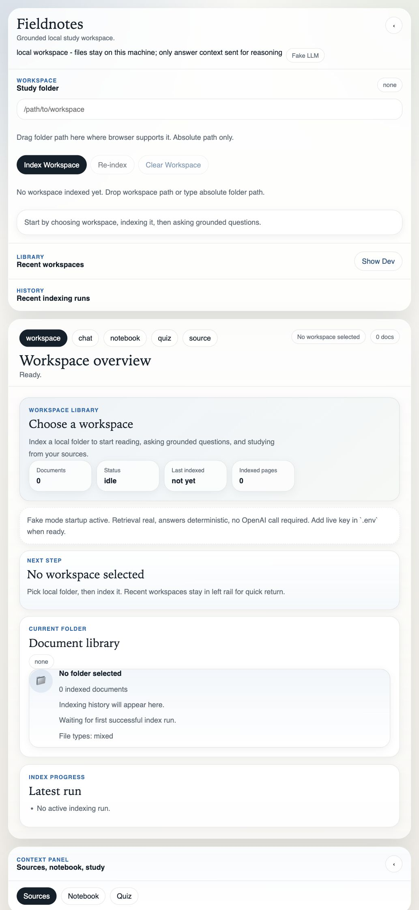
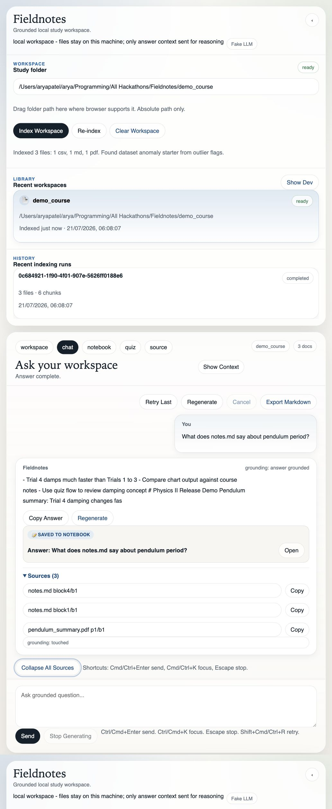
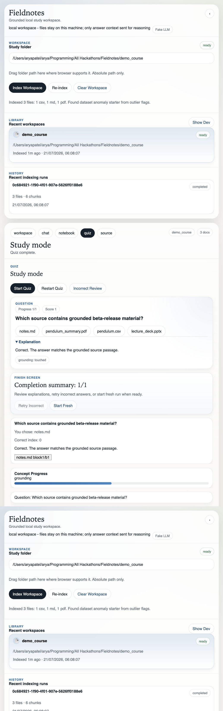
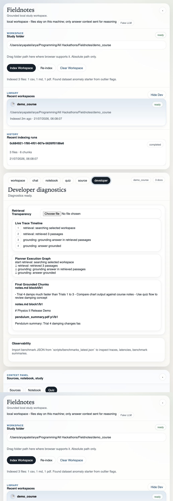

# Fieldnotes

Fieldnotes `1.0.0-beta.1` is local-first AI learning workspace for course folders. Backend indexes course files into local SQLite + retrieval stores. Frontend exposes chat, notebook, quiz, source viewer, developer diagnostics. RC1 hardens release path without changing public APIs.

## Demo









## Security

Generated analysis code runs in restricted sandbox. [backend/sandbox/runtime.py](backend/sandbox/runtime.py) parses scripts with Python AST, allowlists importable modules, blocks dangerous builtins and name references, and routes file access through workspace-jailing helpers plus artifact-only writes. [backend/sandbox/containment.py](backend/sandbox/containment.py) adds OS-level process containment with subprocess timeouts, stdout/stderr caps, and platform-specific process limits. Adversarial coverage lives in [tests/test_sandbox_security.py](tests/test_sandbox_security.py), including path traversal, absolute-path, symlink-escape, and Windows-specific containment checks.

State-changing backend routes reject browser `Origin` and `Referer` headers and FastAPI CORS middleware allows no browser origins, so `localhost` binding alone is not trusted as safety boundary. App still has no authentication and is designed as single-user local tool, not public deployment target.

## Why Responses API

[backend/agent/llm.py](backend/agent/llm.py) uses OpenAI Responses API for function-calling retrieval (`search_index`), strict structured outputs via `json_schema` with `strict: true`, and streamed grounded answer generation.

## Capabilities

- Local indexing for `pdf`, `pptx`, `docx`, `md`, `txt`, `csv`
- Grounded chat over persisted chunks with citations
- Quiz generation and grading from workspace content
- Notebook artifact persistence for explainers, scripts, charts, quiz results
- Source reopening by persisted anchor
- Release smoke verification and benchmark tooling

## Version

- Release: `1.0.0-beta.1`
- Tested Python version: `3.12`
- Backend version source: `backend/config.py`
- Frontend version source: `frontend/package.json`

## Installation Guide

Backend:

```bash
python -m venv .venv312
```

macOS / Linux:

```bash
. .venv312/bin/activate
python -m pip install -r backend/requirements.txt
```

Windows PowerShell:

```powershell
.venv312\Scripts\Activate.ps1
python -m pip install -r backend/requirements.txt
```

Frontend:

```bash
cd frontend
npm install
```

Required environment:

Environment example:

```bash
cp .env.example .env
```

Edit `.env`:

```bash
OPENAI_API_KEY=your_key
OPENAI_MODEL=gpt-5
```

No API key required for local startup. If `OPENAI_API_KEY` is absent, Fieldnotes starts automatically in fake LLM mode. If `OPENAI_API_KEY` is present, Fieldnotes starts automatically in live OpenAI mode. No manual mode switch required.

Optional explicit fake-mode override in `.env`:

```bash
FIELDNOTES_USE_FAKE_LLM=1
```

## Beta Onboarding

Start with [docs/beta-onboarding.md](docs/beta-onboarding.md). It is single path for external beta users and points to install, demo workflow, feedback template, known issues, and release notes.

## Quick Start

Start backend:

```bash
python -m uvicorn backend.main:app --host 127.0.0.1 --port 8000
```

## Docker

Backend-only container:

```bash
docker build -t fieldnotes-backend .
docker run --rm -p 8000:8000 fieldnotes-backend
```

Start frontend dev server:

```bash
cd frontend
npm run dev
```

Vite dev server proxies API requests to `http://127.0.0.1:8000` by default. No `VITE_API_BASE_URL` needed for local development.

Health check:

```bash
curl http://127.0.0.1:8000/health
```

Run portable Phase 0 verification:

```bash
python scripts/exit_phase0.py
```

It checks configuration, startup, health, fake mode, live missing-key validation, and Responses API configuration. `scripts/exit_phase0.sh` is a legacy Unix wrapper.

Run release smoke:

```bash
python scripts/release_check.py
```

Release smoke starts documented `uvicorn` server, waits for `/health`, then exercises real HTTP and SSE endpoints over `127.0.0.1` for indexing, ask, notebook, quiz, and source flows. Script always shuts server down before exit and writes summary to `scripts/release_artifacts/release_check_summary.json`.

`run.sh` is Unix helper only. On Windows, start backend and frontend with direct `python` / `npm` commands above.

## Developer Guide

- Backend entrypoint: `backend/main.py`
- Retrieval/indexing: `backend/indexer/`
- Agent planner/executor: `backend/agent/`
- Sandbox: `backend/sandbox/`
- Observability: `backend/telemetry/tracing.py`
- Frontend shell: `frontend/src/App.tsx`
- Contracts: `docs/schemas.md`
- Release checks: `scripts/release_check.py`
- Benchmarks: `scripts/run_benchmarks.py`

Run checks:

```bash
python -m unittest discover -s tests
cd frontend && npm test
cd frontend && npm run build
python scripts/run_benchmarks.py
python scripts/release_check.py
```

## CI Validation

GitHub Actions keeps fake-mode validation on every push and pull request. That workflow installs backend and frontend dependencies, runs backend tests, frontend tests, benchmarks, and release verification with `FIELDNOTES_USE_FAKE_LLM=1`.

Optional live OpenAI validation runs in separate `live-openai-validation` job only when repository secret `OPENAI_API_KEY` is present. Job runs `python scripts/exit_phase0.py` and `python -m unittest tests.test_live_responses_api_integration` against configured live model. Without secret, job is skipped cleanly. Expected runtime: usually under 1 minute. Expected cost: minimal, one tiny probe plus one tiny integration request.

## Performance

Measured locally on `2026-07-20` against bundled `demo_course/` in `fake-LLM mode`:

- Indexing time: `40.60 ms`
- Ask execution time: `368.02 ms`
- Retrieval latency: `0.33 ms`
- Sandbox execution time: `366.66 ms`
- Indexed files: `3`
- Indexed chunks: `6`

These numbers come from local backend timing only. In this environment, full `scripts/run_benchmarks.py` frontend-build step could not complete because frontend package-manager tooling was unavailable offline, so README reports actual fake-mode backend timings from bundled sample workspace instead.

## Documentation Index

- [Installation guide](docs/installation.md)
- [Quick start](docs/quickstart.md)
- [Developer guide](docs/developer-guide.md)
- [Architecture overview](docs/architecture.md)
- [API reference](docs/api.md)
- [Sandbox security](docs/sandbox-security.md)
- [Troubleshooting](docs/troubleshooting.md)
- [Configuration reference](docs/configuration.md)
- [Beta onboarding](docs/beta-onboarding.md)
- [Beta feedback template](docs/beta-feedback-template.md)
- [Beta known issues](docs/beta-known-issues.md)
- [Release notes](docs/release-notes-1.0.0-beta.1.md)

## Sample Workspace

`demo_course/` contains:

- `pendulum_summary.pdf`
- `notes.md`
- `pendulum.csv`

Use it to exercise indexing, retrieval, notebook, quizzes, source viewer.

## License

Project is MIT licensed. See [LICENSE](LICENSE).
